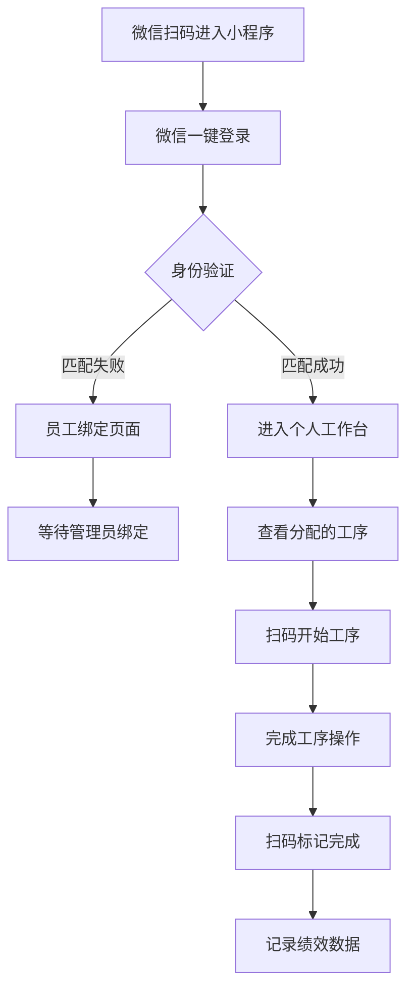
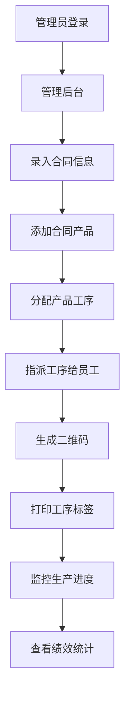

# 上茚管理系统后端部署指南# 版辊加工工厂微信小程序项目文档总览


## 系统要求## 项目简介

- Node.js 18.x 或更高版本

- npm 或 yarn本项目为版辊加工工厂开发一个微信小程序管理系统，通过数字化手段提升工厂生产管理效率。系统支持工人通过微信一键登录，扫码完成工序，实时记录生产绩效，并提供完整的管理后台功能。

- SQLite3 (系统会自动创建数据库文件)

## 核心功能

## 部署步骤

### ### 5. **阿里云部署指南** (./阿里云部署指南.md)

### 1. 下载代码- 阿里云服务选型

```bash- 环境准备和配置

git clone https://github.com/tzwf0819/shangyin.git- 应用部署步骤

cd shangyin- 监控和运维设置

```- 安全加固措施


### 2. 安装依赖### 6. **本地系统集成方案** (./本地系统集成方案.md)

```bash- 现有系统数据迁移策略

cd backend- 双向数据同步机制

npm install- 本地程序API接口

```- 数据一致性保障

- 平滑过渡实施方案系统

### 3. 配置环境- **微信一键登录**: 工人使用微信快速登录

复制并编辑环境配置文件：- **智能身份匹配**: 自动匹配员工身份或进入绑定流程

```bash- **权限管理**: 基于角色的访问控制

cp .env.example .env

```### 👷 工人操作界面  

- **个人工作台**: 显示分配给个人的工序任务

### 4. 启动服务- **扫码完成**: 扫描二维码标记工序完成

```bash- **绩效查看**: 实时查看个人生产数量和效率

npm start

# 或者### 🛠️ 管理后台功能

node app.js- **产品类型管理**: 设置产品类型及对应工序流程

```- **工序管理**: 定义工序类型、标准和要求

- **员工管理**: 管理员工信息和工序权限

## 访问地址- **合同管理**: 录入合同信息并生成二维码

- 管理后台: http://localhost:3000/shangyin/admin

- API接口: http://localhost:3000/shangyin/api### 📊 数据统计分析

- **生产进度监控**: 实时跟踪合同和产品完成情况

## 功能特性- **绩效统计**: 员工工作量和效率统计分析

- ✅ 员工管理- **报表生成**: 多维度数据报表和趋势分析

- ✅ 合同管理  

- ✅ 工序管理## 技术架构

- ✅ 产品类型管理

- ✅ 数据统计仪表盘### 前端技术栈

- ✅ 完全本地化部署（无外部依赖）- **微信小程序**: 原生开发或uni-app框架

- **UI组件**: WeUI 或 Vant Weapp

## 数据库说明- **状态管理**: Vuex (如使用uni-app)

系统使用SQLite数据库，首次启动会自动创建数据库文件和表结构。- **HTTP客户端**: 封装的请求库


## 端口配置### 后端技术栈  

默认端口: 3000- **运行环境**: Node.js 16+

如需修改，请编辑 `backend/app.js` 文件中的端口配置。- **Web框架**: Express.js

- **数据库ORM**: Sequelize

## 故障排除- **认证系统**: JWT Token

1. 端口被占用: 修改 app.js 中的端口号- **文件处理**: Multer + 阿里云OSS

2. 数据库权限问题: 确保有写入权限

3. 依赖安装失败: 尝试 `npm cache clean --force` 后重新安装### 数据存储

- **主数据库**: MySQL 8.0 (阿里云RDS)

## 系统架构- **缓存系统**: Redis (阿里云Redis)

- 后端: Node.js + Express + Sequelize + SQLite- **文件存储**: 阿里云OSS对象存储

- 前端: Vue.js 3 + Axios (本地化)- **CDN加速**: 阿里云CDN

- 数据库: SQLite

### 部署环境

## 最新更新- **云服务器**: 阿里云ECS (CentOS 8)

- 2025-09-23: 修复前端模态框逻辑和HTML转义问题- **负载均衡**: 阿里云SLB

- 2025-09-23: 完成所有依赖本地化，支持离线部署- **网络安全**: VPC + 安全组

- 2025-09-23: 集成合同管理API到管理后台- **SSL证书**: 阿里云免费SSL或商业证书

## 业务流程

### 工人操作流程


### 管理员操作流程


## 数据模型

### 核心实体关系
- **合同 (Contract)** ← 1:n → **产品 (Product)**
- **产品 (Product)** ← 1:n → **产品工序 (ProductProcess)**
- **工序 (Process)** ← 1:n → **产品工序 (ProductProcess)**
- **员工 (Employee)** ← 1:n → **工序权限 (ProcessPermission)**
- **员工 (Employee)** ← 1:n → **工序记录 (ProcessRecord)**
- **员工 (Employee)** ← 1:n → **绩效统计 (Performance)**

### 主要数据表
1. **users** - 用户表 (微信用户信息)
2. **employees** - 员工表 (工厂员工信息)
3. **processes** - 工序表 (工序定义)
4. **product_types** - 产品类型表
5. **hetong_original** - 原始合同表 (本地系统导入数据)
6. **contracts** - 标准合同表 (小程序使用)
7. **products** - 产品表 (工序分解和进度跟踪)
8. **process_records** - 工序记录表
9. **performance** - 绩效统计表

## 文档结构

本项目包含以下完整文档：

### 📋 [微信小程序开发需求文档](./微信小程序开发需求文档.md)
- 项目概述和背景
- 详细功能需求
- 技术架构设计
- 开发计划和时间安排
- 测试要求和交付物

### ⚙️ [配置文件模板](./配置文件模板.md)  
- 服务端配置 (数据库、微信、阿里云等)
- 微信小程序配置
- API接口配置
- Nginx和Docker配置
- 环境变量配置

### 🗄️ [数据库设计文档](./数据库设计文档.md)
- 完整的数据表设计
- 字段定义和约束
- 索引和性能优化
- 数据初始化脚本
- 备份和维护策略

### 🔌 [API接口文档](./API接口文档.md)
- RESTful API规范
- 用户认证接口
- 业务功能接口  
- 错误处理机制
- 接口调用示例

### ☁️ [阿里云部署指南](./阿里云部署指南.md)
- 阿里云服务选型
- 环境准备和配置
- 应用部署步骤
- 监控和运维设置
- 安全加固措施

## 快速开始

### 1. 环境准备
```bash
# 安装Node.js 16+
# 安装MySQL 8.0
# 安装Redis
# 申请微信小程序AppID
# 开通阿里云相关服务
```

### 2. 数据库初始化
```bash
# 创建数据库
mysql -u root -p
CREATE DATABASE factory_management;

# 导入数据库结构
mysql -u root -p factory_management < database/schema.sql
```

### 3. 后端服务启动
```bash
# 克隆项目
git clone https://github.com/your-repo/factory-backend.git
cd factory-backend

# 安装依赖
npm install

# 配置环境变量
cp .env.example .env
# 编辑.env文件，填入正确的配置信息

# 启动服务
npm start
```

### 4. 小程序开发
```bash
# 使用微信开发者工具
# 导入小程序项目
# 配置AppID
# 修改API接口地址
# 预览和调试
```

## 项目特点

### ✅ 业务优势
- **流程数字化**: 传统纸质流程全面数字化
- **实时数据**: 生产数据实时收集和统计
- **权限控制**: 精细化的员工权限管理
- **移动便捷**: 基于微信的便捷操作体验

### 🔧 技术优势  
- **云原生**: 基于阿里云的云原生架构
- **高可用**: 负载均衡和自动故障转移
- **可扩展**: 模块化设计，易于扩展
- **安全可靠**: 完整的安全防护措施

### 📈 性能指标
- **响应时间**: 页面加载 < 2秒
- **并发支持**: 100+ 同时在线用户  
- **可用性**: 99%+ 系统稳定性
- **数据安全**: 多重备份和加密保护

## 开发团队指南

### 开发规范
- 遵循RESTful API设计原则
- 使用ESLint进行代码质量检查
- 采用Git Flow工作流
- 编写单元测试和集成测试

### 代码结构
```
project/
├── backend/                 # 后端服务
│   ├── controllers/         # 控制器
│   ├── models/             # 数据模型  
│   ├── routes/             # 路由定义
│   ├── middleware/         # 中间件
│   └── config/             # 配置文件
├── miniprogram/            # 微信小程序
│   ├── pages/              # 页面
│   ├── components/         # 组件
│   ├── utils/              # 工具函数
│   └── config/             # 配置
├── database/               # 数据库脚本
├── docs/                   # 项目文档
└── deploy/                 # 部署脚本
```

### 版本管理
- **主分支**: main (生产环境)
- **开发分支**: develop (开发环境)  
- **功能分支**: feature/* (新功能开发)
- **修复分支**: hotfix/* (生产环境修复)

## 联系支持

### 技术支持
- 📧 邮箱: tech-support@yourfactory.com
- 📱 电话: 400-xxx-xxxx  
- 💬 微信群: 项目技术交流群

### 项目管理
- 📋 需求管理: 使用项目管理工具跟踪
- 🐛 Bug反馈: 通过Issue系统提交
- 📝 文档更新: 及时更新项目文档

---

*本项目文档为AI开发团队提供了完整的开发指导，确保项目能够高质量、高效率地完成交付。所有配置参数均可根据实际环境进行调整，文档将随项目进展持续更新。*