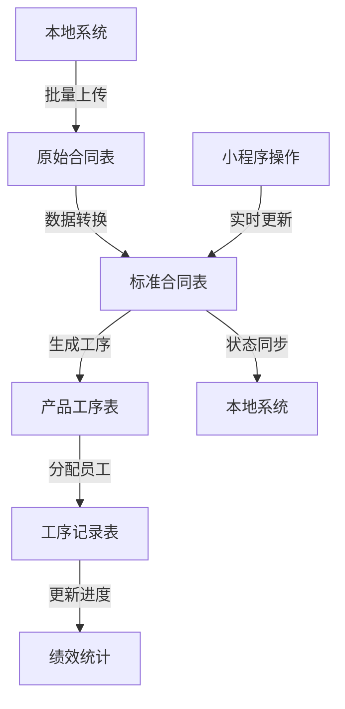

# 数据库设计文档

## 数据库概述

本文档详细描述了版辊加工工厂管理系统的数据库设计，包括所有数据表结构、字段说明、索引设计和关系定义。

## 数据库配置

- **数据库类型**: MySQL 8.0
- **字符编码**: UTF-8MB4
- **排序规则**: utf8mb4_unicode_ci
- **存储引擎**: InnoDB

## 数据表设计

### 1. 用户表 (users)

存储系统用户基本信息和微信登录信息。

```sql
CREATE TABLE `users` (
  `id` int(11) NOT NULL AUTO_INCREMENT COMMENT '用户ID',
  `wechat_openid` varchar(64) NOT NULL COMMENT '微信OpenID',
  `wechat_unionid` varchar(64) DEFAULT NULL COMMENT '微信UnionID',
  `nickname` varchar(100) NOT NULL COMMENT '用户昵称',
  `avatar_url` varchar(255) DEFAULT NULL COMMENT '头像URL',
  `phone` varchar(20) DEFAULT NULL COMMENT '手机号',
  `status` enum('active','inactive','suspended') DEFAULT 'active' COMMENT '用户状态',
  `last_login_at` timestamp NULL DEFAULT NULL COMMENT '最后登录时间',
  `created_at` timestamp NOT NULL DEFAULT CURRENT_TIMESTAMP COMMENT '创建时间',
  `updated_at` timestamp NOT NULL DEFAULT CURRENT_TIMESTAMP ON UPDATE CURRENT_TIMESTAMP COMMENT '更新时间',
  PRIMARY KEY (`id`),
  UNIQUE KEY `uk_wechat_openid` (`wechat_openid`),
  UNIQUE KEY `uk_wechat_unionid` (`wechat_unionid`),
  KEY `idx_status` (`status`),
  KEY `idx_created_at` (`created_at`)
) ENGINE=InnoDB DEFAULT CHARSET=utf8mb4 COLLATE=utf8mb4_unicode_ci COMMENT='用户表';
```

### 2. 员工表 (employees)

存储工厂员工信息和权限设置。

```sql
CREATE TABLE `employees` (
  `id` int(11) NOT NULL AUTO_INCREMENT COMMENT '员工ID',
  `user_id` int(11) DEFAULT NULL COMMENT '关联用户ID',
  `employee_no` varchar(20) NOT NULL COMMENT '员工工号',
  `name` varchar(50) NOT NULL COMMENT '员工姓名',
  `department` varchar(50) DEFAULT NULL COMMENT '部门',
  `position` varchar(50) DEFAULT NULL COMMENT '职位',
  `role` enum('admin','supervisor','worker') DEFAULT 'worker' COMMENT '角色',
  `hire_date` date DEFAULT NULL COMMENT '入职日期',
  `status` enum('active','inactive','resigned') DEFAULT 'active' COMMENT '员工状态',
  `created_at` timestamp NOT NULL DEFAULT CURRENT_TIMESTAMP COMMENT '创建时间',
  `updated_at` timestamp NOT NULL DEFAULT CURRENT_TIMESTAMP ON UPDATE CURRENT_TIMESTAMP COMMENT '更新时间',
  PRIMARY KEY (`id`),
  UNIQUE KEY `uk_employee_no` (`employee_no`),
  UNIQUE KEY `uk_user_id` (`user_id`),
  KEY `idx_status` (`status`),
  KEY `idx_role` (`role`),
  CONSTRAINT `fk_employees_user_id` FOREIGN KEY (`user_id`) REFERENCES `users` (`id`) ON DELETE SET NULL
) ENGINE=InnoDB DEFAULT CHARSET=utf8mb4 COLLATE=utf8mb4_unicode_ci COMMENT='员工表';
```

### 3. 产品类型表 (product_types)

存储产品类型定义和基础信息。

```sql
CREATE TABLE `product_types` (
  `id` int(11) NOT NULL AUTO_INCREMENT COMMENT '产品类型ID',
  `name` varchar(100) NOT NULL COMMENT '产品类型名称',
  `code` varchar(50) NOT NULL COMMENT '产品类型编码',
  `description` text COMMENT '产品类型描述',
  `specification` json DEFAULT NULL COMMENT '规格参数(JSON格式)',
  `standard_processes` json DEFAULT NULL COMMENT '标准工序列表(JSON格式)',
  `estimated_time` int(11) DEFAULT 0 COMMENT '预计总工时(分钟)',
  `status` enum('active','inactive') DEFAULT 'active' COMMENT '状态',
  `created_at` timestamp NOT NULL DEFAULT CURRENT_TIMESTAMP COMMENT '创建时间',
  `updated_at` timestamp NOT NULL DEFAULT CURRENT_TIMESTAMP ON UPDATE CURRENT_TIMESTAMP COMMENT '更新时间',
  PRIMARY KEY (`id`),
  UNIQUE KEY `uk_code` (`code`),
  KEY `idx_status` (`status`),
  KEY `idx_name` (`name`)
) ENGINE=InnoDB DEFAULT CHARSET=utf8mb4 COLLATE=utf8mb4_unicode_ci COMMENT='产品类型表';
```

### 4. 工序表 (processes)

存储工序定义和流程信息。

```sql
CREATE TABLE `processes` (
  `id` int(11) NOT NULL AUTO_INCREMENT COMMENT '工序ID',
  `name` varchar(100) NOT NULL COMMENT '工序名称',
  `code` varchar(50) NOT NULL COMMENT '工序编码',
  `category` varchar(50) DEFAULT NULL COMMENT '工序分类',
  `description` text COMMENT '工序描述',
  `requirements` json DEFAULT NULL COMMENT '工序要求(JSON格式)',
  `standard_time` int(11) DEFAULT 0 COMMENT '标准工时(分钟)',
  `difficulty_level` tinyint(4) DEFAULT 1 COMMENT '难度等级(1-5)',
  `quality_standards` text COMMENT '质量标准',
  `safety_notes` text COMMENT '安全注意事项',
  `tools_required` json DEFAULT NULL COMMENT '所需工具(JSON格式)',
  `status` enum('active','inactive') DEFAULT 'active' COMMENT '状态',
  `created_at` timestamp NOT NULL DEFAULT CURRENT_TIMESTAMP COMMENT '创建时间',
  `updated_at` timestamp NOT NULL DEFAULT CURRENT_TIMESTAMP ON UPDATE CURRENT_TIMESTAMP COMMENT '更新时间',
  PRIMARY KEY (`id`),
  UNIQUE KEY `uk_code` (`code`),
  KEY `idx_status` (`status`),
  KEY `idx_category` (`category`),
  KEY `idx_name` (`name`)
) ENGINE=InnoDB DEFAULT CHARSET=utf8mb4 COLLATE=utf8mb4_unicode_ci COMMENT='工序表';
```

### 5. 员工工序权限表 (employee_process_permissions)

存储员工可以操作的工序权限。

```sql
CREATE TABLE `employee_process_permissions` (
  `id` int(11) NOT NULL AUTO_INCREMENT COMMENT '权限ID',
  `employee_id` int(11) NOT NULL COMMENT '员工ID',
  `process_id` int(11) NOT NULL COMMENT '工序ID',
  `skill_level` tinyint(4) DEFAULT 1 COMMENT '技能等级(1-5)',
  `certified_at` timestamp NULL DEFAULT NULL COMMENT '认证时间',
  `created_at` timestamp NOT NULL DEFAULT CURRENT_TIMESTAMP COMMENT '创建时间',
  `updated_at` timestamp NOT NULL DEFAULT CURRENT_TIMESTAMP ON UPDATE CURRENT_TIMESTAMP COMMENT '更新时间',
  PRIMARY KEY (`id`),
  UNIQUE KEY `uk_employee_process` (`employee_id`,`process_id`),
  KEY `idx_employee_id` (`employee_id`),
  KEY `idx_process_id` (`process_id`),
  CONSTRAINT `fk_emp_process_perm_employee` FOREIGN KEY (`employee_id`) REFERENCES `employees` (`id`) ON DELETE CASCADE,
  CONSTRAINT `fk_emp_process_perm_process` FOREIGN KEY (`process_id`) REFERENCES `processes` (`id`) ON DELETE CASCADE
) ENGINE=InnoDB DEFAULT CHARSET=utf8mb4 COLLATE=utf8mb4_unicode_ci COMMENT='员工工序权限表';
```

### 6. 原始合同表 (hetong_original)

存储从本地系统导入的原始合同数据，保持与您现有数据库结构一致。

```sql
CREATE TABLE [dbo].[hetong_original](
  [id] int IDENTITY(1,1) NOT NULL PRIMARY KEY COMMENT '原始合同主键ID',
  [产品ID] [varchar](50) NULL,
  [合同编号] [varchar](50) NULL,
  [甲方] [varchar](50) NULL,
  [乙方] [varchar](50) NULL,
  [签订日期] [datetime] NULL,
  [签订地点] [varchar](50) NULL,
  [产品编号] [varchar](50) NULL,
  [产品名称] [varchar](50) NULL,
  [规格] [varchar](50) NULL,
  [雕宽] [varchar](50) NULL,
  [网型] [varchar](50) NULL,
  [线数] [varchar](50) NULL,
  [容积率] [varchar](50) NULL,
  [数量] [varchar](50) NULL,
  [单价] [varchar](50) NULL,
  [总金额] [varchar](50) NULL,
  [条款一] [varchar](max) NULL,
  [条款二] [varchar](max) NULL,
  [条款三] [varchar](max) NULL,
  [条款四] [varchar](max) NULL,
  [条款五] [varchar](max) NULL,
  [条款六] [varchar](max) NULL,
  [条款七] [varchar](max) NULL,
  [条款八] [varchar](max) NULL,
  [条款九] [varchar](max) NULL,
  [条款十] [varchar](max) NULL,
  [甲方单位名称] [varchar](50) NULL,
  [甲方单位地址] [varchar](50) NULL,
  [甲方联系人] [varchar](50) NULL,
  [甲方电话传真] [varchar](50) NULL,
  [甲方开户银行] [varchar](50) NULL,
  [甲方行号] [varchar](50) NULL,
  [甲方帐号] [varchar](50) NULL,
  [甲方税号] [varchar](50) NULL,
  [乙方单位名称] [varchar](50) NULL,
  [乙方单位地址] [varchar](50) NULL,
  [乙方联系人] [varchar](50) NULL,
  [乙方电话传真] [varchar](50) NULL,
  [乙方开户银行] [varchar](50) NULL,
  [乙方行号] [varchar](50) NULL,
  [乙方帐号] [varchar](50) NULL,
  [乙方税号] [varchar](50) NULL,
  [合同状态] [varchar](50) NULL,
  [开始生产] [varchar](50) NULL,
  [基辊加工] [varchar](50) NULL,
  [热喷涂] [varchar](50) NULL,
  [陶瓷磨削] [varchar](50) NULL,
  [前续抛光] [varchar](50) NULL,
  [激光雕刻] [varchar](50) NULL,
  [后续抛光] [varchar](50) NULL,
  [检验尺寸] [varchar](50) NULL,
  [包装出库] [varchar](50) NULL,
  [合同属性] [varchar](50) NULL,
  [网穴形状] [varchar](50) NULL,
  [载墨量] [varchar](50) NULL,
  [销售ID] [varchar](50) NULL,
  [新木箱] [varchar](50) NULL,
  [结清日期] [varchar](max) NULL,
  [平厘单价] [varchar](50) NULL,
  [是否回款] [varchar](50) NULL,
  [回款时间] [datetime] NULL,
  [出库日期] [datetime] NULL,
  [是否新图] [varchar](50) NULL,
  [是否审核] [varchar](50) NULL,
  [备注] [varchar](255) NULL,
  [交货期限] [varchar](50) NULL,
  [实际交货日期] [datetime] NULL,
  [是否排产] [varchar](50) NULL,
  [产品类型] [varchar](50) NULL,
  
  -- 数据同步字段
  [sync_status] [varchar](20) NULL DEFAULT 'pending' COMMENT '同步状态：pending/synced/error',
  [sync_time] [datetime] NULL COMMENT '同步时间',
  [sync_error] [varchar](500) NULL COMMENT '同步错误信息',
  [imported_at] [datetime] NULL DEFAULT GETDATE() COMMENT '导入时间',
  [updated_at] [datetime] NULL DEFAULT GETDATE() COMMENT '更新时间'
) ON [PRIMARY] TEXTIMAGE_ON [PRIMARY]

-- 创建索引
CREATE UNIQUE INDEX [IX_hetong_original_contract_product] ON [dbo].[hetong_original] ([合同编号], [产品ID])
CREATE INDEX [IX_hetong_original_sync_status] ON [dbo].[hetong_original] ([sync_status])
CREATE INDEX [IX_hetong_original_imported_at] ON [dbo].[hetong_original] ([imported_at])
```

### 7. 小程序合同表 (contracts)

存储小程序中使用的标准化合同数据，从原始合同表转换而来。

```sql
CREATE TABLE [dbo].[contracts](
  [id] int IDENTITY(1,1) NOT NULL PRIMARY KEY COMMENT '合同主键ID',
  [产品ID] [varchar](50) NULL COMMENT '产品唯一标识',
  [合同编号] [varchar](50) NOT NULL COMMENT '合同编号',
  [甲方] [varchar](50) NULL COMMENT '甲方简称',
  [乙方] [varchar](50) NULL COMMENT '乙方简称',
  [签订日期] [datetime] NULL COMMENT '合同签订日期',
  [签订地点] [varchar](50) NULL COMMENT '合同签订地点',
  
  -- 产品信息
  [产品编号] [varchar](50) NULL COMMENT '产品编号',
  [产品名称] [varchar](50) NULL COMMENT '产品名称',
  [产品类型] [varchar](50) NULL COMMENT '产品类型',
  [规格] [varchar](50) NULL COMMENT '产品规格',
  [雕宽] [varchar](50) NULL COMMENT '雕刻宽度',
  [网型] [varchar](50) NULL COMMENT '网纹类型',
  [网穴形状] [varchar](50) NULL COMMENT '网穴形状',
  [线数] [varchar](50) NULL COMMENT '线数规格',
  [容积率] [varchar](50) NULL COMMENT '容积率',
  [载墨量] [varchar](50) NULL COMMENT '载墨量',
  [数量] [varchar](50) NULL COMMENT '产品数量',
  [单价] [varchar](50) NULL COMMENT '产品单价',
  [平厘单价] [varchar](50) NULL COMMENT '平厘单价',
  [总金额] [varchar](50) NULL COMMENT '合同总金额',
  
  -- 合同条款
  [条款一] [varchar](max) NULL COMMENT '合同条款一',
  [条款二] [varchar](max) NULL COMMENT '合同条款二',
  [条款三] [varchar](max) NULL COMMENT '合同条款三',
  [条款四] [varchar](max) NULL COMMENT '合同条款四',
  [条款五] [varchar](max) NULL COMMENT '合同条款五',
  [条款六] [varchar](max) NULL COMMENT '合同条款六',
  [条款七] [varchar](max) NULL COMMENT '合同条款七',
  [条款八] [varchar](max) NULL COMMENT '合同条款八',
  [条款九] [varchar](max) NULL COMMENT '合同条款九',
  [条款十] [varchar](max) NULL COMMENT '合同条款十',
  
  -- 甲方信息
  [甲方单位名称] [varchar](100) NULL COMMENT '甲方单位全称',
  [甲方单位地址] [varchar](200) NULL COMMENT '甲方单位地址',
  [甲方联系人] [varchar](50) NULL COMMENT '甲方联系人',
  [甲方电话传真] [varchar](50) NULL COMMENT '甲方联系电话',
  [甲方开户银行] [varchar](100) NULL COMMENT '甲方开户银行',
  [甲方行号] [varchar](50) NULL COMMENT '甲方银行行号',
  [甲方帐号] [varchar](50) NULL COMMENT '甲方银行账号',
  [甲方税号] [varchar](50) NULL COMMENT '甲方税务登记号',
  
  -- 乙方信息
  [乙方单位名称] [varchar](100) NULL COMMENT '乙方单位全称',
  [乙方单位地址] [varchar](200) NULL COMMENT '乙方单位地址',
  [乙方联系人] [varchar](50) NULL COMMENT '乙方联系人',
  [乙方电话传真] [varchar](50) NULL COMMENT '乙方联系电话',
  [乙方开户银行] [varchar](100) NULL COMMENT '乙方开户银行',
  [乙方行号] [varchar](50) NULL COMMENT '乙方银行行号',
  [乙方帐号] [varchar](50) NULL COMMENT '乙方银行账号',
  [乙方税号] [varchar](50) NULL COMMENT '乙方税务登记号',
  
  -- 生产流程状态 (版辊加工特有工序)
  [合同状态] [varchar](50) NULL COMMENT '合同状态：待生产/生产中/已完成/已取消',
  [开始生产] [varchar](50) NULL COMMENT '开始生产状态和时间',
  [基辊加工] [varchar](50) NULL COMMENT '基辊加工完成状态',
  [热喷涂] [varchar](50) NULL COMMENT '热喷涂工序状态',
  [陶瓷磨削] [varchar](50) NULL COMMENT '陶瓷磨削工序状态',
  [前续抛光] [varchar](50) NULL COMMENT '前续抛光工序状态',
  [激光雕刻] [varchar](50) NULL COMMENT '激光雕刻工序状态',
  [后续抛光] [varchar](50) NULL COMMENT '后续抛光工序状态',
  [检验尺寸] [varchar](50) NULL COMMENT '检验尺寸工序状态',
  [包装出库] [varchar](50) NULL COMMENT '包装出库工序状态',
  
  -- 业务管理字段
  [合同属性] [varchar](50) NULL COMMENT '合同属性分类',
  [销售ID] [varchar](50) NULL COMMENT '销售人员ID',
  [新木箱] [varchar](50) NULL COMMENT '是否需要新木箱',
  [交货期限] [varchar](50) NULL COMMENT '交货期限要求',
  [实际交货日期] [datetime] NULL COMMENT '实际交货日期',
  [出库日期] [datetime] NULL COMMENT '出库日期',
  
  -- 财务相关
  [结清日期] [varchar](max) NULL COMMENT '合同结清日期',
  [是否回款] [varchar](50) NULL COMMENT '是否已回款',
  [回款时间] [datetime] NULL COMMENT '回款时间',
  
  -- 审核和排产
  [是否新图] [varchar](50) NULL COMMENT '是否使用新图纸',
  [是否审核] [varchar](50) NULL COMMENT '合同是否已审核',
  [是否排产] [varchar](50) NULL COMMENT '是否已安排生产',
  
  -- 其他信息
  [备注] [varchar](500) NULL COMMENT '合同备注信息',
  
  -- 小程序扩展字段
  [qr_code] [varchar](500) NULL COMMENT '合同二维码数据',
  [miniprogram_visible] [bit] NULL DEFAULT 1 COMMENT '小程序中是否可见',
  [progress_percentage] [decimal](5,2) NULL DEFAULT 0.00 COMMENT '总体完成进度百分比',
  [current_process] [varchar](50) NULL COMMENT '当前进行的工序',
  [estimated_completion] [datetime] NULL COMMENT '预计完成时间',
  [created_at] [datetime] NULL DEFAULT GETDATE() COMMENT '记录创建时间',
  [updated_at] [datetime] NULL DEFAULT GETDATE() COMMENT '记录更新时间',
  [created_by] [varchar](50) NULL COMMENT '创建人',
  [updated_by] [varchar](50) NULL COMMENT '更新人'
) ON [PRIMARY] TEXTIMAGE_ON [PRIMARY]

  -- 数据溯源字段
  [original_hetong_id] [int] NULL COMMENT '关联原始合同表ID',
  [data_source] [varchar](20) NULL DEFAULT 'import' COMMENT '数据来源：import/manual/api'
) ON [PRIMARY] TEXTIMAGE_ON [PRIMARY]

-- 创建索引
CREATE UNIQUE INDEX [IX_contracts_contract_no] ON [dbo].[contracts] ([合同编号])
CREATE INDEX [IX_contracts_status] ON [dbo].[contracts] ([合同状态])
CREATE INDEX [IX_contracts_product_id] ON [dbo].[contracts] ([产品ID])
CREATE INDEX [IX_contracts_date] ON [dbo].[contracts] ([签订日期])
CREATE INDEX [IX_contracts_customer] ON [dbo].[contracts] ([甲方单位名称])
CREATE INDEX [IX_contracts_miniprogram] ON [dbo].[contracts] ([miniprogram_visible])
CREATE INDEX [IX_contracts_progress] ON [dbo].[contracts] ([progress_percentage])
CREATE INDEX [IX_contracts_original_id] ON [dbo].[contracts] ([original_hetong_id])

-- 外键约束
ALTER TABLE [dbo].[contracts] ADD CONSTRAINT [FK_contracts_original] 
  FOREIGN KEY ([original_hetong_id]) REFERENCES [dbo].[hetong_original] ([id])
```

### 8. 产品表 (products)

由于合同表已包含产品信息，这个表主要用于产品的工序分解和进度跟踪。

```sql
CREATE TABLE [dbo].[products] (
  [id] int IDENTITY(1,1) NOT NULL PRIMARY KEY COMMENT '产品ID',
  [contract_id] int NULL COMMENT '关联合同ID',
  [产品ID] [varchar](50) NULL COMMENT '产品唯一标识(关联合同表)',
  [合同编号] [varchar](50) NULL COMMENT '合同编号',
  [产品编号] [varchar](50) NULL COMMENT '产品编号',
  [产品名称] [varchar](100) NULL COMMENT '产品名称',
  [产品类型] [varchar](50) NULL COMMENT '产品类型',
  
  -- 产品规格 (从合同表继承)
  [规格] [varchar](50) NULL COMMENT '产品规格',
  [雕宽] [varchar](50) NULL COMMENT '雕刻宽度',
  [网型] [varchar](50) NULL COMMENT '网纹类型',
  [网穴形状] [varchar](50) NULL COMMENT '网穴形状',
  [线数] [varchar](50) NULL COMMENT '线数规格',
  [容积率] [varchar](50) NULL COMMENT '容积率',
  [载墨量] [varchar](50) NULL COMMENT '载墨量',
  [数量] [int] NULL COMMENT '产品数量',
  [单价] [decimal](10,2) NULL COMMENT '单价',
  [总价] [decimal](15,2) NULL COMMENT '总价',
  
  -- 生产状态
  [status] [varchar](50) NULL DEFAULT 'pending' COMMENT '产品状态：pending/in_progress/completed/cancelled',
  [progress_percentage] [decimal](5,2) DEFAULT 0.00 COMMENT '完成进度百分比',
  [current_process] [varchar](50) NULL COMMENT '当前工序',
  [estimated_completion] [datetime] NULL COMMENT '预计完成时间',
  [actual_completion] [datetime] NULL COMMENT '实际完成时间',
  
  -- 工序进度 (版辊加工特有工序)
  [基辊加工_status] [varchar](20) NULL COMMENT '基辊加工状态',
  [基辊加工_start_time] [datetime] NULL COMMENT '基辊加工开始时间',
  [基辊加工_end_time] [datetime] NULL COMMENT '基辊加工完成时间',
  [基辊加工_worker_id] [varchar](50) NULL COMMENT '基辊加工工人ID',
  
  [热喷涂_status] [varchar](20) NULL COMMENT '热喷涂状态',
  [热喷涂_start_time] [datetime] NULL COMMENT '热喷涂开始时间',
  [热喷涂_end_time] [datetime] NULL COMMENT '热喷涂完成时间',
  [热喷涂_worker_id] [varchar](50) NULL COMMENT '热喷涂工人ID',
  
  [陶瓷磨削_status] [varchar](20) NULL COMMENT '陶瓷磨削状态',
  [陶瓷磨削_start_time] [datetime] NULL COMMENT '陶瓷磨削开始时间',
  [陶瓷磨削_end_time] [datetime] NULL COMMENT '陶瓷磨削完成时间',
  [陶瓷磨削_worker_id] [varchar](50) NULL COMMENT '陶瓷磨削工人ID',
  
  [前续抛光_status] [varchar](20) NULL COMMENT '前续抛光状态',
  [前续抛光_start_time] [datetime] NULL COMMENT '前续抛光开始时间',
  [前续抛光_end_time] [datetime] NULL COMMENT '前续抛光完成时间',
  [前续抛光_worker_id] [varchar](50) NULL COMMENT '前续抛光工人ID',
  
  [激光雕刻_status] [varchar](20) NULL COMMENT '激光雕刻状态',
  [激光雕刻_start_time] [datetime] NULL COMMENT '激光雕刻开始时间',
  [激光雕刻_end_time] [datetime] NULL COMMENT '激光雕刻完成时间',
  [激光雕刻_worker_id] [varchar](50) NULL COMMENT '激光雕刻工人ID',
  
  [后续抛光_status] [varchar](20) NULL COMMENT '后续抛光状态',
  [后续抛光_start_time] [datetime] NULL COMMENT '后续抛光开始时间',
  [后续抛光_end_time] [datetime] NULL COMMENT '后续抛光完成时间',
  [后续抛光_worker_id] [varchar](50) NULL COMMENT '后续抛光工人ID',
  
  [检验尺寸_status] [varchar](20) NULL COMMENT '检验尺寸状态',
  [检验尺寸_start_time] [datetime] NULL COMMENT '检验尺寸开始时间',
  [检验尺寸_end_time] [datetime] NULL COMMENT '检验尺寸完成时间',
  [检验尺寸_worker_id] [varchar](50) NULL COMMENT '检验尺寸工人ID',
  
  [包装出库_status] [varchar](20) NULL COMMENT '包装出库状态',
  [包装出库_start_time] [datetime] NULL COMMENT '包装出库开始时间',
  [包装出库_end_time] [datetime] NULL COMMENT '包装出库完成时间',
  [包装出库_worker_id] [varchar](50) NULL COMMENT '包装出库工人ID',
  
  -- 质量和备注
  [quality_notes] [varchar](500) NULL COMMENT '质量备注',
  [special_requirements] [varchar](500) NULL COMMENT '特殊要求',
  [qr_code] [varchar](500) NULL COMMENT '产品二维码',
  [images] [varchar](max) NULL COMMENT '产品图片URL列表(JSON格式)',
  
  -- 时间戳
  [created_at] [datetime] NULL DEFAULT GETDATE() COMMENT '创建时间',
  [updated_at] [datetime] NULL DEFAULT GETDATE() COMMENT '更新时间',
  
  -- 外键约束
  CONSTRAINT [FK_products_contracts] FOREIGN KEY ([contract_id]) REFERENCES [dbo].[contracts] ([id])
) ON [PRIMARY] TEXTIMAGE_ON [PRIMARY]

-- 创建索引
CREATE INDEX [IX_products_contract_id] ON [dbo].[products] ([contract_id])
CREATE INDEX [IX_products_product_id] ON [dbo].[products] ([产品ID])
CREATE INDEX [IX_products_contract_no] ON [dbo].[products] ([合同编号])
CREATE INDEX [IX_products_status] ON [dbo].[products] ([status])
CREATE INDEX [IX_products_progress] ON [dbo].[products] ([progress_percentage])
```

### 8. 产品工序表 (product_processes)

存储每个产品需要执行的具体工序。

```sql
CREATE TABLE `product_processes` (
  `id` int(11) NOT NULL AUTO_INCREMENT COMMENT '产品工序ID',
  `product_id` int(11) NOT NULL COMMENT '产品ID',
  `process_id` int(11) NOT NULL COMMENT '工序ID',
  `sequence_no` int(11) NOT NULL COMMENT '工序顺序号',
  `assigned_employee_id` int(11) DEFAULT NULL COMMENT '指派员工ID',
  `estimated_time` int(11) DEFAULT 0 COMMENT '预计工时(分钟)',
  `status` enum('pending','assigned','in_progress','completed','skipped') DEFAULT 'pending' COMMENT '工序状态',
  `started_at` timestamp NULL DEFAULT NULL COMMENT '开始时间',
  `completed_at` timestamp NULL DEFAULT NULL COMMENT '完成时间',
  `actual_time` int(11) DEFAULT 0 COMMENT '实际用时(分钟)',
  `quality_score` decimal(3,1) DEFAULT NULL COMMENT '质量评分(1-10)',
  `notes` text COMMENT '备注信息',
  `qr_code` varchar(255) DEFAULT NULL COMMENT '工序二维码',
  `created_at` timestamp NOT NULL DEFAULT CURRENT_TIMESTAMP COMMENT '创建时间',
  `updated_at` timestamp NOT NULL DEFAULT CURRENT_TIMESTAMP ON UPDATE CURRENT_TIMESTAMP COMMENT '更新时间',
  PRIMARY KEY (`id`),
  UNIQUE KEY `uk_product_process_seq` (`product_id`,`sequence_no`),
  KEY `idx_product_id` (`product_id`),
  KEY `idx_process_id` (`process_id`),
  KEY `idx_assigned_employee_id` (`assigned_employee_id`),
  KEY `idx_status` (`status`),
  CONSTRAINT `fk_product_processes_product` FOREIGN KEY (`product_id`) REFERENCES `products` (`id`) ON DELETE CASCADE,
  CONSTRAINT `fk_product_processes_process` FOREIGN KEY (`process_id`) REFERENCES `processes` (`id`),
  CONSTRAINT `fk_product_processes_employee` FOREIGN KEY (`assigned_employee_id`) REFERENCES `employees` (`id`) ON DELETE SET NULL
) ENGINE=InnoDB DEFAULT CHARSET=utf8mb4 COLLATE=utf8mb4_unicode_ci COMMENT='产品工序表';
```

### 9. 工序记录表 (process_records)

存储工序执行的详细记录。

```sql
CREATE TABLE `process_records` (
  `id` int(11) NOT NULL AUTO_INCREMENT COMMENT '记录ID',
  `product_process_id` int(11) NOT NULL COMMENT '产品工序ID',
  `employee_id` int(11) NOT NULL COMMENT '执行员工ID',
  `action_type` enum('start','pause','resume','complete','rework') NOT NULL COMMENT '操作类型',
  `action_time` timestamp NOT NULL DEFAULT CURRENT_TIMESTAMP COMMENT '操作时间',
  `location` varchar(100) DEFAULT NULL COMMENT '操作地点',
  `device_info` json DEFAULT NULL COMMENT '设备信息(JSON格式)',
  `scan_data` json DEFAULT NULL COMMENT '扫码数据(JSON格式)',
  `notes` text COMMENT '备注信息',
  `images` json DEFAULT NULL COMMENT '相关图片(JSON格式)',
  `created_at` timestamp NOT NULL DEFAULT CURRENT_TIMESTAMP COMMENT '创建时间',
  PRIMARY KEY (`id`),
  KEY `idx_product_process_id` (`product_process_id`),
  KEY `idx_employee_id` (`employee_id`),
  KEY `idx_action_time` (`action_time`),
  KEY `idx_action_type` (`action_type`),
  CONSTRAINT `fk_process_records_product_process` FOREIGN KEY (`product_process_id`) REFERENCES `product_processes` (`id`) ON DELETE CASCADE,
  CONSTRAINT `fk_process_records_employee` FOREIGN KEY (`employee_id`) REFERENCES `employees` (`id`)
) ENGINE=InnoDB DEFAULT CHARSET=utf8mb4 COLLATE=utf8mb4_unicode_ci COMMENT='工序记录表';
```

### 10. 绩效表 (performance)

存储员工绩效统计数据。

```sql
CREATE TABLE `performance` (
  `id` int(11) NOT NULL AUTO_INCREMENT COMMENT '绩效ID',
  `employee_id` int(11) NOT NULL COMMENT '员工ID',
  `process_id` int(11) NOT NULL COMMENT '工序ID',
  `date` date NOT NULL COMMENT '统计日期',
  `completed_count` int(11) DEFAULT 0 COMMENT '完成数量',
  `total_time` int(11) DEFAULT 0 COMMENT '总用时(分钟)',
  `average_time` decimal(8,2) DEFAULT 0.00 COMMENT '平均用时(分钟)',
  `quality_score` decimal(3,1) DEFAULT NULL COMMENT '平均质量评分',
  `efficiency_score` decimal(5,2) DEFAULT 0.00 COMMENT '效率评分',
  `created_at` timestamp NOT NULL DEFAULT CURRENT_TIMESTAMP COMMENT '创建时间',
  `updated_at` timestamp NOT NULL DEFAULT CURRENT_TIMESTAMP ON UPDATE CURRENT_TIMESTAMP COMMENT '更新时间',
  PRIMARY KEY (`id`),
  UNIQUE KEY `uk_employee_process_date` (`employee_id`,`process_id`,`date`),
  KEY `idx_employee_id` (`employee_id`),
  KEY `idx_process_id` (`process_id`),
  KEY `idx_date` (`date`),
  CONSTRAINT `fk_performance_employee` FOREIGN KEY (`employee_id`) REFERENCES `employees` (`id`) ON DELETE CASCADE,
  CONSTRAINT `fk_performance_process` FOREIGN KEY (`process_id`) REFERENCES `processes` (`id`)
) ENGINE=InnoDB DEFAULT CHARSET=utf8mb4 COLLATE=utf8mb4_unicode_ci COMMENT='绩效表';
```

### 11. 系统日志表 (system_logs)

存储系统操作日志。

```sql
CREATE TABLE `system_logs` (
  `id` int(11) NOT NULL AUTO_INCREMENT COMMENT '日志ID',
  `user_id` int(11) DEFAULT NULL COMMENT '操作用户ID',
  `employee_id` int(11) DEFAULT NULL COMMENT '操作员工ID',
  `module` varchar(50) NOT NULL COMMENT '操作模块',
  `action` varchar(100) NOT NULL COMMENT '操作动作',
  `target_type` varchar(50) DEFAULT NULL COMMENT '目标类型',
  `target_id` int(11) DEFAULT NULL COMMENT '目标ID',
  `details` json DEFAULT NULL COMMENT '操作详情(JSON格式)',
  `ip_address` varchar(45) DEFAULT NULL COMMENT 'IP地址',
  `user_agent` varchar(255) DEFAULT NULL COMMENT '用户代理',
  `result` enum('success','failure','error') DEFAULT 'success' COMMENT '操作结果',
  `error_message` text COMMENT '错误信息',
  `created_at` timestamp NOT NULL DEFAULT CURRENT_TIMESTAMP COMMENT '创建时间',
  PRIMARY KEY (`id`),
  KEY `idx_user_id` (`user_id`),
  KEY `idx_employee_id` (`employee_id`),
  KEY `idx_module` (`module`),
  KEY `idx_created_at` (`created_at`),
  KEY `idx_result` (`result`),
  CONSTRAINT `fk_system_logs_user` FOREIGN KEY (`user_id`) REFERENCES `users` (`id`) ON DELETE SET NULL,
  CONSTRAINT `fk_system_logs_employee` FOREIGN KEY (`employee_id`) REFERENCES `employees` (`id`) ON DELETE SET NULL
) ENGINE=InnoDB DEFAULT CHARSET=utf8mb4 COLLATE=utf8mb4_unicode_ci COMMENT='系统日志表';
```

### 12. 附件表 (attachments)

存储系统中的文件附件信息。

```sql
CREATE TABLE `attachments` (
  `id` int(11) NOT NULL AUTO_INCREMENT COMMENT '附件ID',
  `related_type` varchar(50) NOT NULL COMMENT '关联类型',
  `related_id` int(11) NOT NULL COMMENT '关联ID',
  `file_name` varchar(255) NOT NULL COMMENT '文件名',
  `original_name` varchar(255) NOT NULL COMMENT '原始文件名',
  `file_size` bigint(20) DEFAULT 0 COMMENT '文件大小(字节)',
  `file_type` varchar(100) DEFAULT NULL COMMENT '文件类型',
  `file_url` varchar(500) NOT NULL COMMENT '文件URL',
  `storage_type` enum('local','oss','cdn') DEFAULT 'local' COMMENT '存储类型',
  `uploaded_by` int(11) DEFAULT NULL COMMENT '上传者ID',
  `created_at` timestamp NOT NULL DEFAULT CURRENT_TIMESTAMP COMMENT '创建时间',
  PRIMARY KEY (`id`),
  KEY `idx_related_type_id` (`related_type`,`related_id`),
  KEY `idx_uploaded_by` (`uploaded_by`),
  KEY `idx_created_at` (`created_at`),
  CONSTRAINT `fk_attachments_uploaded_by` FOREIGN KEY (`uploaded_by`) REFERENCES `users` (`id`) ON DELETE SET NULL
) ENGINE=InnoDB DEFAULT CHARSET=utf8mb4 COLLATE=utf8mb4_unicode_ci COMMENT='附件表';
```

## 数据库关系图

```
users (1) ←--→ (0..1) employees
employees (1) ←--→ (0..n) employee_process_permissions ←--→ (1) processes
employees (1) ←--→ (0..n) product_processes
employees (1) ←--→ (0..n) process_records
employees (1) ←--→ (0..n) performance

contracts (1) ←--→ (0..8) products
products (1) ←--→ (1) product_types
products (1) ←--→ (0..100) product_processes ←--→ (1) processes
product_processes (1) ←--→ (0..n) process_records

employees (1) ←--→ (0..n) system_logs ←--→ (0..1) users
```

## 索引策略

### 主要索引
1. **主键索引**: 所有表的`id`字段
2. **唯一索引**: 业务唯一标识字段
3. **外键索引**: 所有外键字段
4. **状态索引**: 所有`status`字段
5. **时间索引**: 关键时间字段

### 复合索引
1. `employee_process_permissions`: (`employee_id`, `process_id`)
2. `product_processes`: (`product_id`, `sequence_no`)
3. `performance`: (`employee_id`, `process_id`, `date`)
4. `system_logs`: (`created_at`, `module`)

## 数据初始化脚本

```sql
-- 插入默认管理员用户
INSERT INTO `users` (`wechat_openid`, `nickname`, `status`) VALUES
('admin_openid', '系统管理员', 'active');

-- 插入默认员工
INSERT INTO `employees` (`user_id`, `employee_no`, `name`, `role`, `status`) VALUES
(1, 'EMP001', '系统管理员', 'admin', 'active');

-- 插入版辊加工工序
INSERT INTO `processes` (`name`, `code`, `category`, `description`, `standard_time`, `difficulty_level`) VALUES
('基辊加工', 'P001', '基础加工', '基辊的初步机械加工', 240, 3),
('热喷涂', 'P002', '表面处理', '在基辊表面进行热喷涂处理', 180, 4),
('陶瓷磨削', 'P003', '精密加工', '陶瓷涂层的精密磨削', 300, 5),
('前续抛光', 'P004', '表面处理', '激光雕刻前的表面抛光', 120, 3),
('激光雕刻', 'P005', '核心工序', '激光雕刻网纹图案', 360, 5),
('后续抛光', 'P006', '精加工', '雕刻后的精细抛光', 150, 4),
('检验尺寸', 'P007', '质量控制', '尺寸和质量检验', 60, 2),
('包装出库', 'P008', '后期处理', '产品包装和出库', 45, 1);

-- 插入版辊产品类型
INSERT INTO `product_types` (`name`, `code`, `description`, `estimated_time`) VALUES
('凹版印刷版辊', 'PT001', '用于凹版印刷的版辊产品', 1455),
('柔版印刷版辊', 'PT002', '用于柔版印刷的版辊产品', 1200),
('网纹辊', 'PT003', '专用网纹传墨辊', 800),
('定制版辊', 'PT004', '客户定制规格版辊', 1800);
```

## 数据同步策略

### 同步流程设计



### 数据同步存储过程

```sql
-- 创建合同数据转换存储过程
CREATE PROCEDURE [dbo].[sp_SyncContractFromOriginal]
    @original_id INT
AS
BEGIN
    SET NOCOUNT ON;
    
    DECLARE @contract_id INT;
    
    -- 插入或更新标准合同表
    MERGE [dbo].[contracts] AS target
    USING (
        SELECT 
            [产品ID], [合同编号], [甲方], [乙方], [签订日期],
            [产品编号], [产品名称], [产品类型], [规格], [数量],
            [单价], [总金额], [甲方单位名称], [甲方联系人],
            [甲方电话传真], [合同状态], [备注], [id] as original_id
        FROM [dbo].[hetong_original] 
        WHERE [id] = @original_id
    ) AS source
    ON target.[合同编号] = source.[合同编号] AND target.[产品ID] = source.[产品ID]
    
    WHEN MATCHED THEN
        UPDATE SET 
            [甲方] = source.[甲方],
            [乙方] = source.[乙方],
            [签订日期] = source.[签订日期],
            [产品名称] = source.[产品名称],
            [数量] = source.[数量],
            [单价] = source.[单价],
            [总金额] = source.[总金额],
            [合同状态] = source.[合同状态],
            [updated_at] = GETDATE()
    
    WHEN NOT MATCHED THEN
        INSERT ([产品ID], [合同编号], [甲方], [乙方], [签订日期], 
                [产品编号], [产品名称], [产品类型], [规格], [数量],
                [单价], [总金额], [甲方单位名称], [甲方联系人],
                [甲方电话传真], [合同状态], [备注], [original_hetong_id],
                [data_source], [miniprogram_visible], [created_at])
        VALUES (source.[产品ID], source.[合同编号], source.[甲方], source.[乙方], 
                source.[签订日期], source.[产品编号], source.[产品名称], 
                source.[产品类型], source.[规格], source.[数量], source.[单价],
                source.[总金额], source.[甲方单位名称], source.[甲方联系人],
                source.[甲方电话传真], source.[合同状态], source.[备注],
                source.original_id, 'import', 1, GETDATE());
    
    -- 获取合同ID
    SELECT @contract_id = [id] FROM [dbo].[contracts] 
    WHERE [合同编号] = (SELECT [合同编号] FROM [dbo].[hetong_original] WHERE [id] = @original_id)
      AND [产品ID] = (SELECT [产品ID] FROM [dbo].[hetong_original] WHERE [id] = @original_id);
    
    -- 创建产品记录
    EXEC [dbo].[sp_CreateProductFromContract] @contract_id;
    
    -- 更新同步状态
    UPDATE [dbo].[hetong_original] 
    SET [sync_status] = 'synced', [sync_time] = GETDATE()
    WHERE [id] = @original_id;
    
    SELECT @contract_id as contract_id;
END

-- 创建产品工序生成存储过程
CREATE PROCEDURE [dbo].[sp_CreateProductFromContract]
    @contract_id INT
AS
BEGIN
    SET NOCOUNT ON;
    
    DECLARE @product_id INT;
    
    -- 插入产品记录
    INSERT INTO [dbo].[products] (
        [contract_id], [产品ID], [合同编号], [产品编号], [产品名称],
        [产品类型], [规格], [雕宽], [网型], [网穴形状], [线数], 
        [容积率], [载墨量], [数量], [单价], [总价], [status]
    )
    SELECT 
        @contract_id, [产品ID], [合同编号], [产品编号], [产品名称],
        [产品类型], [规格], [雕宽], [网型], [网穴形状], [线数],
        [容积率], [载墨量], 
        CAST([数量] AS INT), 
        CAST([单价] AS DECIMAL(10,2)),
        CAST([总金额] AS DECIMAL(15,2)),
        'pending'
    FROM [dbo].[contracts]
    WHERE [id] = @contract_id;
    
    SET @product_id = SCOPE_IDENTITY();
    
    -- 根据原始合同工序状态更新产品工序状态
    UPDATE p SET
        [基辊加工_status] = CASE WHEN c.[基辊加工] LIKE '%完成%' THEN 'completed'
                                 WHEN c.[基辊加工] LIKE '%进行%' THEN 'in_progress'
                                 ELSE 'pending' END,
        [热喷涂_status] = CASE WHEN c.[热喷涂] LIKE '%完成%' THEN 'completed'
                               WHEN c.[热喷涂] LIKE '%进行%' THEN 'in_progress'
                               ELSE 'pending' END,
        [陶瓷磨削_status] = CASE WHEN c.[陶瓷磨削] LIKE '%完成%' THEN 'completed'
                                 WHEN c.[陶瓷磨削] LIKE '%进行%' THEN 'in_progress'
                                 ELSE 'pending' END,
        [前续抛光_status] = CASE WHEN c.[前续抛光] LIKE '%完成%' THEN 'completed'
                                 WHEN c.[前续抛光] LIKE '%进行%' THEN 'in_progress'
                                 ELSE 'pending' END,
        [激光雕刻_status] = CASE WHEN c.[激光雕刻] LIKE '%完成%' THEN 'completed'
                                 WHEN c.[激光雕刻] LIKE '%进行%' THEN 'in_progress'
                                 ELSE 'pending' END,
        [后续抛光_status] = CASE WHEN c.[后续抛光] LIKE '%完成%' THEN 'completed'
                                 WHEN c.[后续抛光] LIKE '%进行%' THEN 'in_progress'
                                 ELSE 'pending' END,
        [检验尺寸_status] = CASE WHEN c.[检验尺寸] LIKE '%完成%' THEN 'completed'
                                 WHEN c.[检验尺寸] LIKE '%进行%' THEN 'in_progress'
                                 ELSE 'pending' END,
        [包装出库_status] = CASE WHEN c.[包装出库] LIKE '%完成%' THEN 'completed'
                                 WHEN c.[包装出库] LIKE '%进行%' THEN 'in_progress'
                                 ELSE 'pending' END
    FROM [dbo].[products] p
    JOIN [dbo].[contracts] ct ON p.[contract_id] = ct.[id]
    JOIN [dbo].[hetong_original] c ON ct.[original_hetong_id] = c.[id]
    WHERE p.[id] = @product_id;
    
    -- 计算进度百分比
    EXEC [dbo].[sp_UpdateProductProgress] @product_id;
END

-- 更新产品进度存储过程
CREATE PROCEDURE [dbo].[sp_UpdateProductProgress]
    @product_id INT
AS
BEGIN
    SET NOCOUNT ON;
    
    DECLARE @completed_count INT = 0;
    DECLARE @total_count INT = 8; -- 总共8个工序
    DECLARE @progress DECIMAL(5,2);
    DECLARE @current_process VARCHAR(50);
    
    -- 计算已完成工序数量
    SELECT @completed_count = (
        CASE WHEN [基辊加工_status] = 'completed' THEN 1 ELSE 0 END +
        CASE WHEN [热喷涂_status] = 'completed' THEN 1 ELSE 0 END +
        CASE WHEN [陶瓷磨削_status] = 'completed' THEN 1 ELSE 0 END +
        CASE WHEN [前续抛光_status] = 'completed' THEN 1 ELSE 0 END +
        CASE WHEN [激光雕刻_status] = 'completed' THEN 1 ELSE 0 END +
        CASE WHEN [后续抛光_status] = 'completed' THEN 1 ELSE 0 END +
        CASE WHEN [检验尺寸_status] = 'completed' THEN 1 ELSE 0 END +
        CASE WHEN [包装出库_status] = 'completed' THEN 1 ELSE 0 END
    )
    FROM [dbo].[products] WHERE [id] = @product_id;
    
    -- 计算进度百分比
    SET @progress = (@completed_count * 100.0) / @total_count;
    
    -- 确定当前工序
    SELECT @current_process = 
        CASE 
            WHEN [基辊加工_status] = 'in_progress' THEN '基辊加工'
            WHEN [热喷涂_status] = 'in_progress' THEN '热喷涂'
            WHEN [陶瓷磨削_status] = 'in_progress' THEN '陶瓷磨削'
            WHEN [前续抛光_status] = 'in_progress' THEN '前续抛光'
            WHEN [激光雕刻_status] = 'in_progress' THEN '激光雕刻'
            WHEN [后续抛光_status] = 'in_progress' THEN '后续抛光'
            WHEN [检验尺寸_status] = 'in_progress' THEN '检验尺寸'
            WHEN [包装出库_status] = 'in_progress' THEN '包装出库'
            WHEN [基辊加工_status] = 'pending' THEN '基辊加工'
            WHEN [热喷涂_status] = 'pending' THEN '热喷涂'
            WHEN [陶瓷磨削_status] = 'pending' THEN '陶瓷磨削'
            WHEN [前续抛光_status] = 'pending' THEN '前续抛光'
            WHEN [激光雕刻_status] = 'pending' THEN '激光雕刻'
            WHEN [后续抛光_status] = 'pending' THEN '后续抛光'
            WHEN [检验尺寸_status] = 'pending' THEN '检验尺寸'
            WHEN [包装出库_status] = 'pending' THEN '包装出库'
            ELSE '已完成'
        END
    FROM [dbo].[products] WHERE [id] = @product_id;
    
    -- 更新进度
    UPDATE [dbo].[products]
    SET [progress_percentage] = @progress,
        [current_process] = @current_process,
        [status] = CASE WHEN @progress = 100 THEN 'completed'
                       WHEN @progress > 0 THEN 'in_progress'
                       ELSE 'pending' END
    WHERE [id] = @product_id;
    
    -- 同步更新合同表进度
    UPDATE c
    SET [progress_percentage] = (
        SELECT AVG([progress_percentage]) 
        FROM [dbo].[products] 
        WHERE [contract_id] = c.[id]
    ),
    [current_process] = @current_process
    FROM [dbo].[contracts] c
    JOIN [dbo].[products] p ON c.[id] = p.[contract_id]
    WHERE p.[id] = @product_id;
END
```

## 性能优化建议

### 1. 查询优化
- 使用合适的索引策略
- 避免全表扫描查询
- 合理使用分页查询
- 优化复杂关联查询

### 2. 存储优化
- 定期清理历史日志数据
- 使用分区表处理大数据量
- 合理设置字段类型和长度
- 使用JSON字段存储灵活数据

### 3. 维护策略
- 定期分析表统计信息
- 监控慢查询日志
- 定期备份重要数据
- 设置合理的连接池参数

## 数据备份策略

### 1. 全量备份
- 每日凌晨进行全量备份
- 保留最近30天的备份文件
- 备份文件存储到阿里云OSS

### 2. 增量备份
- 每小时进行增量备份
- 基于binlog进行增量恢复
- 保证数据的完整性和一致性

### 3. 备份脚本示例

```bash
#!/bin/bash
# 数据库备份脚本
DATE=$(date +%Y%m%d_%H%M%S)
BACKUP_DIR="/backup/mysql"
DB_NAME="factory_management"

# 创建备份目录
mkdir -p $BACKUP_DIR

# 执行备份
mysqldump -h$DB_HOST -u$DB_USER -p$DB_PASS \
  --single-transaction \
  --routines \
  --triggers \
  $DB_NAME > $BACKUP_DIR/${DB_NAME}_${DATE}.sql

# 压缩备份文件
gzip $BACKUP_DIR/${DB_NAME}_${DATE}.sql

# 上传到OSS (可选)
# ossutil cp $BACKUP_DIR/${DB_NAME}_${DATE}.sql.gz oss://your-backup-bucket/
```

---

*本数据库设计确保了系统的可扩展性、性能和数据完整性，为工厂管理系统提供了坚实的数据基础。*