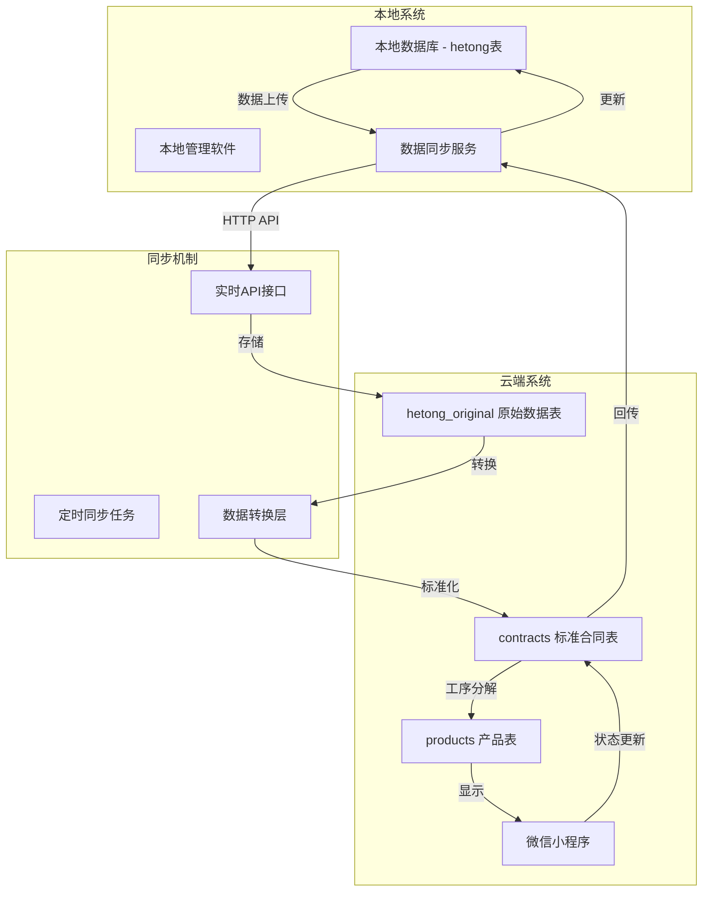

# 本地系统集成方案

## 集成概述

本方案详细说明如何将您现有的本地版辊加工管理系统与新的微信小程序系统进行集成，实现数据双向同步和统一管理。

## 系统架构



## 数据表关系

### 原始数据保持
- **hetong_original表**: 完全保持您现有的表结构，用于存储从本地系统导入的原始数据
- **数据字段映射**: 1:1映射，不做任何修改，确保数据完整性

### 标准化数据转换
- **contracts表**: 标准化的合同数据，适配小程序展示需求
- **products表**: 产品工序分解，支持精细化进度管理
- **自动转换**: 通过存储过程自动将原始数据转换为标准格式

## 同步策略

### 1. 数据上传流程

#### 批量导入历史数据
```bash
# 本地系统执行SQL导出
sqlcmd -S localhost -d 工厂管理DB -Q "SELECT * FROM hetong" -o contracts_export.json

# 通过API批量上传
curl -X POST https://api.yourfactory.com/sync/contracts/batch \
  -H "Content-Type: application/json" \
  -H "Authorization: Bearer {admin_token}" \
  -d @contracts_export.json
```

#### 增量数据同步
```sql
-- 本地系统创建触发器，监控数据变化
CREATE TRIGGER tr_hetong_sync ON hetong
AFTER INSERT, UPDATE
AS
BEGIN
    -- 标记需要同步的记录
    INSERT INTO sync_queue (table_name, record_id, action, created_at)
    SELECT 'hetong', i.合同编号, 'upsert', GETDATE()
    FROM inserted i
END
```

### 2. 实时状态同步

#### 小程序状态回传
```javascript
// 小程序完成工序后自动回传状态
function updateProcessStatus(contractNo, processName, status) {
  wx.request({
    url: `${API_BASE}/sync/contracts/${contractNo}/progress`,
    method: 'PUT',
    data: {
      [processName]: status,
      updated_by: 'miniprogram',
      update_time: new Date().toISOString()
    }
  })
}
```

#### 本地系统获取更新
```csharp
// C# 示例 - 本地系统定时获取更新
public async Task SyncProgressFromCloud()
{
    var updates = await httpClient.GetAsync("/sync/pending-updates");
    var data = await updates.Content.ReadAsAsync<SyncData>();
    
    foreach(var contract in data.Contracts)
    {
        // 更新本地数据库
        await UpdateLocalContract(contract);
    }
}
```

## API接口规范

### 认证机制
```json
{
  "endpoint": "/auth/system-login",
  "method": "POST",
  "request": {
    "client_id": "local_system_client",
    "client_secret": "your_secure_secret",
    "grant_type": "client_credentials"
  },
  "response": {
    "access_token": "system_token_here",
    "token_type": "Bearer",
    "expires_in": 86400
  }
}
```

### 批量上传合同
```json
{
  "endpoint": "/sync/contracts/batch",
  "method": "POST",
  "headers": {
    "Authorization": "Bearer {system_token}",
    "Content-Type": "application/json"
  },
  "request": {
    "contracts": [
      {
        "产品ID": "P20230917001",
        "合同编号": "HT2023001", 
        "甲方": "客户A",
        "产品名称": "凹版印刷辊",
        "合同状态": "生产中",
        "基辊加工": "已完成",
        "热喷涂": "进行中"
      }
    ],
    "overwrite": true,
    "source": "local_system"
  }
}
```

### 获取状态更新
```json
{
  "endpoint": "/sync/pending-updates",
  "method": "GET", 
  "params": {
    "since": "2023-09-17T00:00:00Z",
    "limit": 100
  },
  "response": {
    "contracts": [
      {
        "合同编号": "HT2023001",
        "产品ID": "P20230917001",
        "progress_percentage": 45.5,
        "current_process": "陶瓷磨削",
        "updated_at": "2023-09-17T15:30:00Z",
        "updated_by": "worker_zhang"
      }
    ]
  }
}
```

## 本地系统改造建议

### 1. 数据库改造

#### 添加同步字段
```sql
-- 在现有hetong表添加同步字段
ALTER TABLE hetong ADD 
  sync_status VARCHAR(20) DEFAULT 'pending',
  sync_time DATETIME NULL,
  cloud_contract_id INT NULL,
  last_sync_hash VARCHAR(64) NULL;

-- 创建同步队列表
CREATE TABLE sync_queue (
  id INT IDENTITY(1,1) PRIMARY KEY,
  table_name VARCHAR(50) NOT NULL,
  record_id VARCHAR(50) NOT NULL,
  action VARCHAR(20) NOT NULL, -- insert/update/delete
  data_snapshot TEXT NULL,
  sync_status VARCHAR(20) DEFAULT 'pending',
  created_at DATETIME DEFAULT GETDATE(),
  synced_at DATETIME NULL,
  error_message VARCHAR(500) NULL
);
```

### 2. 同步服务开发

#### C# WinForms 同步服务示例
```csharp
public class CloudSyncService
{
    private readonly HttpClient httpClient;
    private readonly string apiBaseUrl;
    private readonly Timer syncTimer;
    
    public CloudSyncService(string baseUrl, string clientId, string clientSecret)
    {
        this.apiBaseUrl = baseUrl;
        this.httpClient = new HttpClient();
        
        // 设置定时同步 - 每5分钟同步一次
        this.syncTimer = new Timer(300000);
        this.syncTimer.Elapsed += OnSyncTimer;
        this.syncTimer.Start();
    }
    
    // 上传新增/修改的合同
    public async Task<bool> UploadContracts()
    {
        try
        {
            var pendingContracts = GetPendingSyncContracts();
            if (!pendingContracts.Any()) return true;
            
            var request = new
            {
                contracts = pendingContracts,
                overwrite = true,
                source = "local_system"
            };
            
            var response = await httpClient.PostAsync(
                $"{apiBaseUrl}/sync/contracts/batch",
                new StringContent(JsonConvert.SerializeObject(request), 
                                Encoding.UTF8, "application/json"));
            
            if (response.IsSuccessStatusCode)
            {
                // 更新同步状态
                await UpdateSyncStatus(pendingContracts.Select(c => c.合同编号));
                return true;
            }
            
            return false;
        }
        catch (Exception ex)
        {
            LogError($"上传合同失败: {ex.Message}");
            return false;
        }
    }
    
    // 下载云端状态更新
    public async Task<bool> DownloadUpdates()
    {
        try
        {
            var response = await httpClient.GetAsync(
                $"{apiBaseUrl}/sync/pending-updates?since={GetLastSyncTime()}");
                
            if (response.IsSuccessStatusCode)
            {
                var updates = await response.Content.ReadAsAsync<SyncUpdates>();
                
                foreach (var contract in updates.Contracts)
                {
                    await UpdateLocalContractProgress(contract);
                }
                
                return true;
            }
            
            return false;
        }
        catch (Exception ex)
        {
            LogError($"下载更新失败: {ex.Message}");
            return false;
        }
    }
    
    private async void OnSyncTimer(object sender, ElapsedEventArgs e)
    {
        await UploadContracts();
        await DownloadUpdates();
    }
}
```

### 3. 用户界面集成

#### 同步状态显示
```csharp
// 在主窗体添加同步状态面板
public partial class MainForm : Form
{
    private CloudSyncService syncService;
    private StatusLabel lblSyncStatus;
    private Button btnManualSync;
    
    private void InitializeSyncUI()
    {
        // 同步状态标签
        lblSyncStatus = new StatusLabel 
        { 
            Text = "同步状态: 未连接",
            BackColor = Color.Yellow 
        };
        
        // 手动同步按钮
        btnManualSync = new Button 
        { 
            Text = "立即同步",
            Click += OnManualSync 
        };
        
        // 添加到状态栏
        statusStrip.Items.Add(lblSyncStatus);
        statusStrip.Items.Add(btnManualSync);
    }
    
    private async void OnManualSync(object sender, EventArgs e)
    {
        lblSyncStatus.Text = "同步中...";
        lblSyncStatus.BackColor = Color.Orange;
        
        bool success = await syncService.UploadContracts() && 
                      await syncService.DownloadUpdates();
        
        lblSyncStatus.Text = success ? "同步成功" : "同步失败";
        lblSyncStatus.BackColor = success ? Color.LightGreen : Color.Pink;
    }
}
```

## 配置文件

### 本地系统配置 (SyncConfig.json)
```json
{
  "cloudApi": {
    "baseUrl": "https://api.yourfactory.com",
    "clientId": "local_system_client",
    "clientSecret": "your_secure_secret_here",
    "timeout": 30000
  },
  "database": {
    "connectionString": "Server=.;Database=工厂管理DB;Integrated Security=true;",
    "syncTableName": "hetong",
    "queueTableName": "sync_queue"
  },
  "sync": {
    "intervalMinutes": 5,
    "batchSize": 50,
    "retryCount": 3,
    "enableAutoSync": true
  },
  "logging": {
    "level": "Info",
    "filePath": "./logs/sync.log",
    "maxFileSize": "10MB"
  }
}
```

### 云端API配置 (server/config/sync.js)
```javascript
module.exports = {
  sync: {
    // 允许的客户端ID列表
    allowedClients: [
      {
        clientId: 'local_system_client',
        clientSecret: process.env.LOCAL_SYSTEM_SECRET,
        permissions: ['contracts:write', 'employees:write', 'processes:write']
      }
    ],
    
    // 数据转换规则
    fieldMapping: {
      'hetong_original': {
        '产品ID': 'product_id',
        '合同编号': 'contract_no',
        '甲方': 'party_a',
        '乙方': 'party_b'
      }
    },
    
    // 同步限制
    limits: {
      batchSize: 100,
      dailyLimit: 10000,
      rateLimitPerMinute: 60
    }
  }
};
```

## 部署步骤

### 1. 云端部署
1. 按照阿里云部署指南部署微信小程序后端
2. 创建系统认证账号和密钥
3. 配置数据库表和存储过程
4. 测试同步API接口

### 2. 本地系统改造
1. 备份现有数据库
2. 执行数据库结构升级脚本
3. 部署同步服务程序
4. 配置同步参数和认证信息
5. 执行初次数据同步

### 3. 测试验证
1. 测试历史数据导入
2. 验证增量数据同步
3. 测试小程序状态回传
4. 确认数据一致性

## 监控和维护

### 同步状态监控
- 实时同步状态显示
- 同步失败自动重试
- 异常情况邮件通知
- 同步日志记录和分析

### 数据一致性检查
```sql
-- 定期执行一致性检查
CREATE PROCEDURE sp_CheckDataConsistency
AS
BEGIN
    -- 检查原始表与标准表数据差异
    SELECT o.合同编号, o.产品ID, '原始表存在，标准表不存在' as issue_type
    FROM hetong_original o
    LEFT JOIN contracts c ON o.合同编号 = c.合同编号 AND o.产品ID = c.产品ID
    WHERE c.id IS NULL AND o.sync_status = 'synced'
    
    UNION ALL
    
    -- 检查进度数据差异
    SELECT c.合同编号, c.产品ID, '进度数据不一致' as issue_type
    FROM contracts c
    JOIN hetong_original o ON c.original_hetong_id = o.id
    WHERE c.progress_percentage IS NULL OR c.current_process IS NULL
END
```

---

*本集成方案确保您的现有本地系统能够平滑过渡到新的微信小程序系统，实现数据的双向同步和统一管理，不影响现有业务流程的同时，为工厂管理带来数字化升级。*